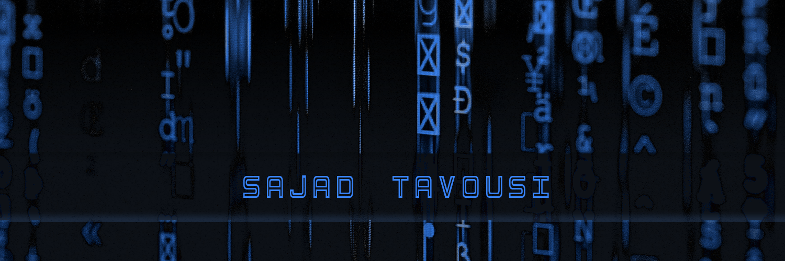

### Hi there, my name is Sajad 🚀

#### 👋 Introduction

##### I am Sajad, a Front-End specialist with a passion for user interface design and interactive website development. Experience in HTML, CSS and JavaScript, React allows me to turn creative ideas into reality. I see the design of user interfaces as an exciting challenge and by following the principles of design, I try to bring an optimal user experience. Along with technical abilities, I always seek to learn the latest technologies and development methods.

#### 🚀 Languages and tools

   
  
  
  
  
  
   
  
  
  

#### 🌠 Social networks

</a>

